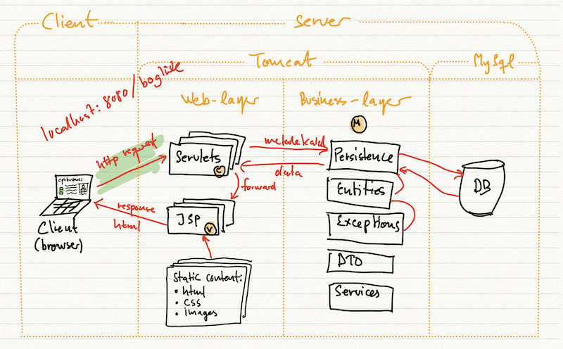

# default-web-applikation med page controller

## Startkode på 2. semester efterår 2022

Dette repository er lavet i forbindelse med 2. semester på
Datamatikeruddannelsen i Lyngby og på Bornholm efterår 2022.

## Java version
I pom.xml er diverse dependencies valgt, så projektet kan bygges og køres i Java 8. Nyere versioner af 
Java vil formentlig også fungere, men vi har kun testet med version 8 og 11.

## Tomcat
Brug version 9.x

## Deployment på Droplet
T.B.D.

## Du skal gøre følgende for at få webapplikationen i luften:

1. Beslut dig for hvad projektets database skal hedde.
2. Først skal du clone projektet eller downloade en zip-fil med projektet til din arbejdsstation.
   1. Clone: `git clone git@github.com:jonbertelsen/startcode_2sem_2022.git ditprojektnavn`
   2. Slet .git folderen, så du kan gøre projektet til dit eget git-projekt
      1. > `rm -rf .git/`
   3. Opret dit eget git repository:
      1. > `git init`
2. Det er en god idé at ændre folder-navnet inden du åbner projektet i IntelliJ. Det kan også være en god ide at åbne pom.xml i en simpel editor og rette "name" og "artifactid" før du åbner projektet i IntelliJ. På den måde er navngivningen korrekt fra starten.
3. Åbn Workbench og kør en tilpasset (med dit databasenavn i stedet for `startcode`) version af sql-filen `startcode.sql`, som ligger i mappen `resources`. Den opretter en database med en user-tabel og en test-database.
4. Du skal evt. ændre kodeord til databasen i projektet. Det gøres i filerne: `/persistence/ConnectionPool` i linie 14 og 15. Du skal også ændre i UserMapperTest.
5. Refactor `startcode` til dit eget projekt alle de steder, hvor det er relevant. Fx her:
   1. I projektroden
   2. I pom.xml (`artifactId`og `name` elementerne)
6. Til sidst skal du lave en Tomcat konfiguration. Dvs, 
   1. klik på "Add Configuration ..."
   2. Klik på "+" og vælg "Tomcat Server Local".
   3. Klik på "Fix knappen"
   4. Vælg war-exploded som deployment type
   5. Nu kan du klikke på den grønne play-knap for at bygge og køre projektet.
7. Lav et repo på GitHub til dit projekt

## Bemærkninger

### Startkoden indeholder følgende:

- Strukturering i passende packages for overblik (MVC). Noget af strukturen er også givet af Maven, og kan ikke laves om. F.eks. opdelingen i `/java` og `/webapp`.
- Javaservlets
- JSP sider. Læg dem i WEB-INF som kun skal tilgås via en servlet. Der ligger allerede `welcome.jsp`
- En super skrabet css-fil til styling
- Datamapper for user-tabellen, som anvender en connection pool. Den er package-protected
- En facadeklasse `UserFacade`, der bruges til at tilgå dine mappermetoder
- Fejlhåndtering med exceptions for databaseoperationer. Den skriver også til Tomcat log.
- Integrationstest af datamapperen for User.

### Funktionelt kan applikationen:

- Vise en forside med links til undersider, som endnu ikke er lavet
- Logge en user på. Der findes to brugere i databasen.
    1. `user` med password: `1234` (rolle: `user`)
    2. `admin` med password: `1234` (rolle: `admin`)
- Man kan se på `index.jsp` og `WEB-INF/welcome.jsp` hvordan man kan udnytte om en user er logget på eller ej.
- Hvis man indtaster ugyldige data under indlogning, bliver man sendt til en en fejlside.
- Logge en bruger af
- Metoden `isRoleAllowed(String role, HttpServletRequest request)` som ligger i pakken `services`. Den tjekker om en given bruger matcher en given rolle.

## MVC arkitektur

